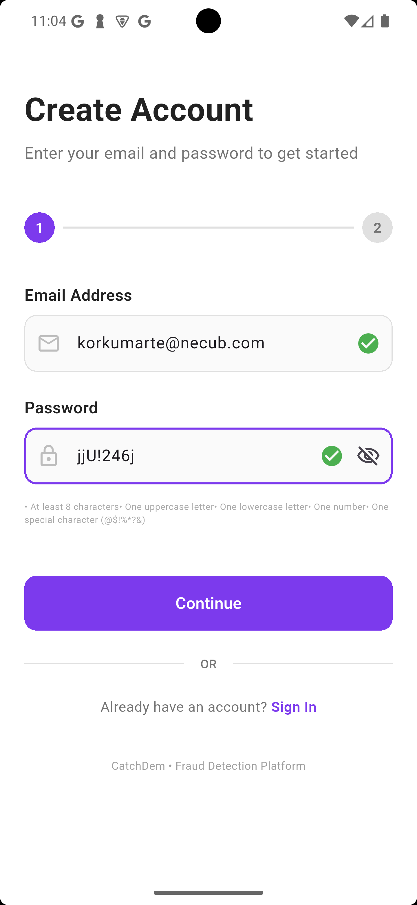
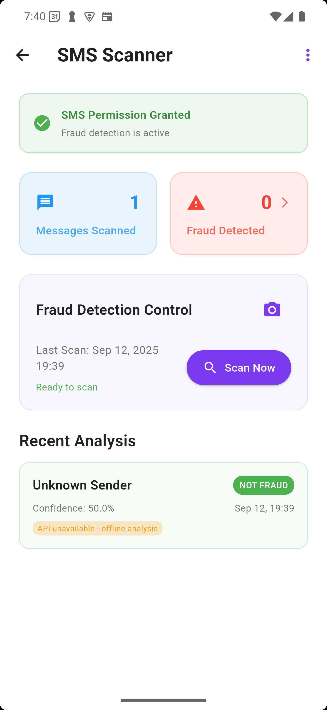
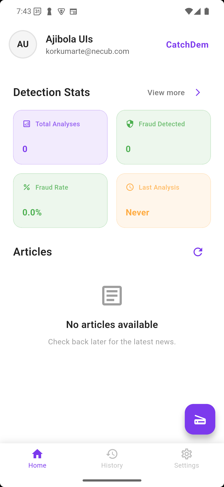
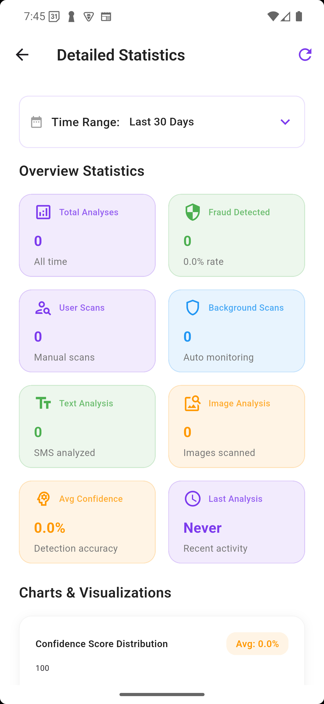
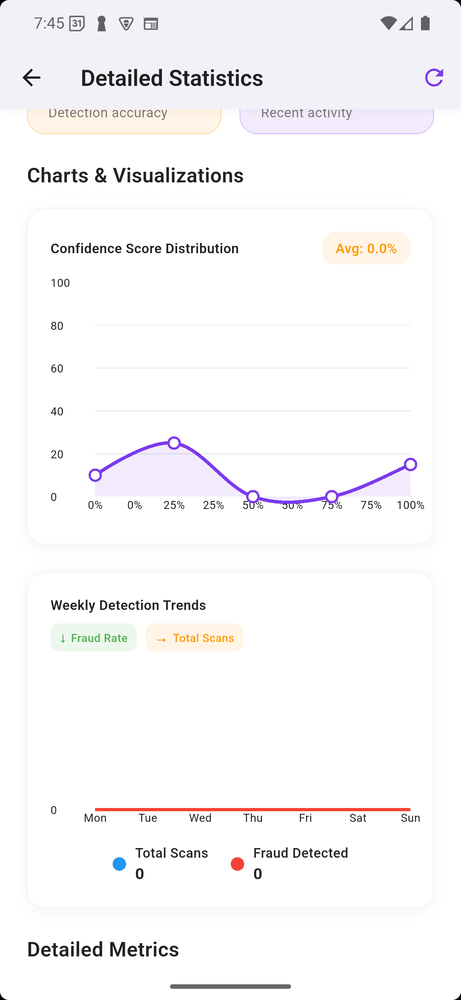
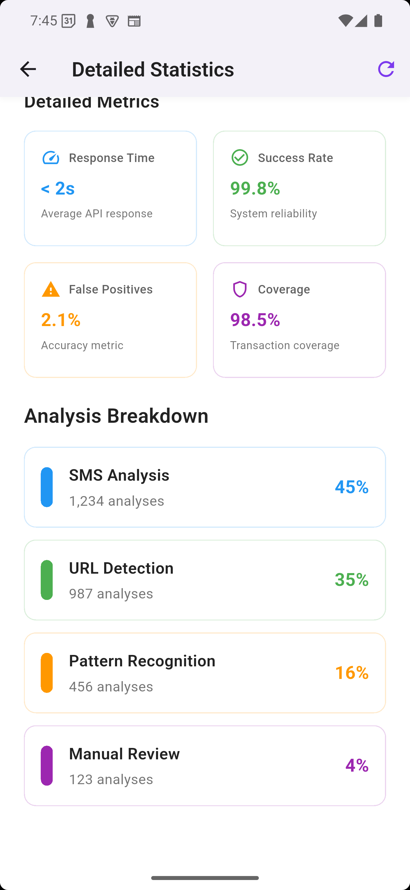
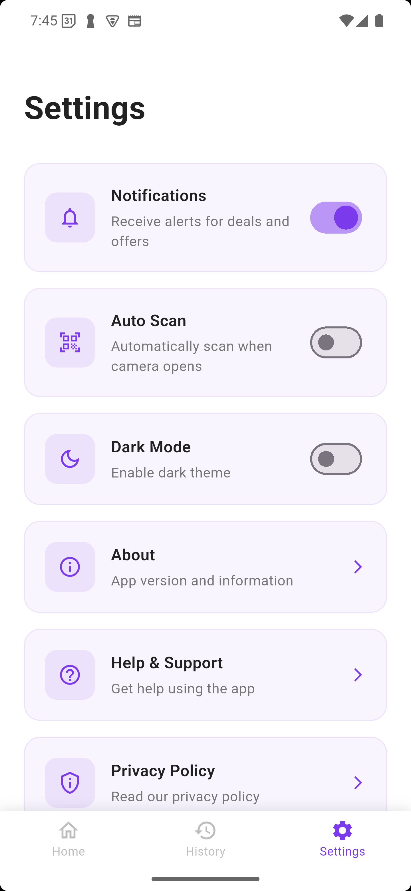

# CatchDem - Mobile Fraud Detection App

<div align="center">
  
  <h3>🚨 Advanced SMS Fraud Detection for Mobile Money Security</h3>
  <p>Protect yourself from fraudulent SMS messages with AI-powered detection and real-time monitoring</p>
</div>

## 📱 App Screenshots

<div align="center">
  
  
  
  
  
  
</div>

## 🎯 Project Overview

**CatchDem** is a comprehensive mobile fraud detection application built with Flutter that helps users identify and protect themselves from fraudulent SMS messages, particularly those targeting mobile money transactions. The app uses advanced AI-powered analysis to detect various types of fraud including phishing, social engineering, SIM swap attacks, and unauthorized transfers.

### 🏆 Hackathon Project

This project was developed for the **MoMo Hackathon** and focuses on enhancing mobile money security through intelligent SMS analysis and fraud prevention.

## ✨ Key Features

### 🔍 **Real-time SMS Analysis**

- **Background Monitoring**: Automatically scans incoming SMS messages for fraud indicators
- **Manual Scanning**: On-demand analysis of specific messages
- **Image Analysis**: Scan images for fraudulent content using camera or gallery
- **Multi-source Detection**: Analyzes both text and image-based fraud attempts

### 🛡️ **Advanced Fraud Detection**

- **Phishing Detection**: Identifies suspicious links and phishing keywords
- **Social Engineering**: Detects manipulation tactics and urgent language
- **SIM Swap Detection**: Recognizes SIM swap attack patterns
- **Sender Spoofing**: Identifies fake sender impersonation
- **Risk Assessment**: Provides confidence scores and risk levels

### 📊 **Comprehensive Analytics**

- **Real-time Statistics**: Live fraud detection metrics and trends
- **Detailed Reports**: In-depth analysis with confidence scores
- **Historical Data**: Track fraud patterns over time
- **Visual Charts**: Interactive graphs and trend analysis
- **Export Capabilities**: Generate reports in multiple formats

### 🔔 **Smart Notifications**

- **Instant Alerts**: Immediate notification of detected fraud
- **Risk Level Indicators**: Color-coded risk assessment
- **Red Flag Warnings**: Detailed breakdown of suspicious elements
- **Confidence Scoring**: Percentage-based fraud likelihood

### 📰 **Security News Feed**

- **Latest Articles**: Stay updated with fraud prevention news
- **Security Tips**: Educational content on mobile money safety
- **Trend Analysis**: Current fraud patterns and prevention strategies

## 🏗️ Technical Architecture

### **Frontend (Flutter)**

- **Framework**: Flutter 3.9.0+ with Dart
- **State Management**: GetX for reactive state management
- **UI Components**: Material Design with custom theming
- **Charts**: FL Chart for data visualization
- **Image Processing**: Image picker and SVG support

### **Backend Integration**

- **API Communication**: RESTful API integration with Dio HTTP client
- **Authentication**: Secure user authentication and session management
- **Data Storage**: Local Hive database with secure encryption
- **Background Processing**: WorkManager for background SMS monitoring

### **Key Dependencies**

```yaml
dependencies:
  flutter: sdk
  get: ^4.7.2                    # State management
  permission_handler: ^11.3.1    # SMS permissions
  another_telephony: ^0.4.1      # SMS reading
  workmanager: ^0.9.0+3          # Background processing
  dio: ^5.4.3+1                  # HTTP client
  hive_flutter: ^1.1.0           # Local database
  fl_chart: ^0.68.0              # Data visualization
  image_picker: ^1.0.7           # Image handling
  share_plus: ^7.2.2             # Report sharing
```

## 🚀 Getting Started

### **Prerequisites**

- Flutter SDK 3.9.0 or higher
- Dart SDK 3.0.0 or higher
- Android Studio / VS Code
- Android device or emulator (API level 21+)

### **Installation**

1. **Clone the repository**

   ```bash
   git clone https://github.com/your-username/momo_hackathon.git
   cd momo_hackathon
   ```

2. **Install dependencies**

   ```bash
   flutter pub get
   ```

3. **Configure permissions**
   - Add SMS read permissions in `android/app/src/main/AndroidManifest.xml`
   - Configure background processing permissions

4. **Run the application**

   ```bash
   flutter run
   ```

### **Build for Production**

```bash
# Android APK
flutter build apk --release

# Android App Bundle
flutter build appbundle --release

# iOS (requires macOS)
flutter build ios --release
```

## 📱 App Structure

```
lib/
├── app/
│   ├── data/
│   │   ├── models/           # Data models and entities
│   │   └── services/         # API and business logic services
│   ├── modules/              # Feature-based modules
│   │   ├── home/            # Dashboard and overview
│   │   ├── sms_scanner/     # SMS analysis functionality
│   │   ├── fraud_messages/  # Fraud detection results
│   │   ├── detailed_stats/  # Analytics and reporting
│   │   ├── history/         # Analysis history
│   │   ├── settings/        # App configuration
│   │   └── auth/            # Authentication
│   └── routes/              # Navigation and routing
└── main.dart                # App entry point
```

## 🔧 Configuration

### **API Configuration**

Update the base URL in `lib/app/data/services/network/base_network_service.dart`:

```dart
static const String baseUrl = 'https://your-api-endpoint.com/api';
```

### **Permission Setup**

Ensure the following permissions are granted:

- `android.permission.READ_SMS`
- `android.permission.RECEIVE_SMS`
- `android.permission.CAMERA`
- `android.permission.READ_EXTERNAL_STORAGE`

## 🛡️ Security Features

### **Data Protection**

- **Local Encryption**: Sensitive data encrypted using Hive with crypto
- **Secure Storage**: User credentials and analysis data protected
- **Privacy First**: No personal SMS content sent to external servers without consent

### **Fraud Detection Algorithms**

- **Pattern Recognition**: Advanced regex patterns for fraud detection
- **Machine Learning**: AI-powered analysis for complex fraud patterns
- **Risk Scoring**: Multi-factor risk assessment algorithm
- **Real-time Analysis**: Instant fraud detection with minimal latency

## 📊 Analytics & Reporting

### **Dashboard Metrics**

- Total messages analyzed
- Fraud detection rate
- Confidence scores
- Risk level distribution
- Historical trends

### **Export Options**

- PDF reports with charts and analysis
- CSV data export for further analysis
- Shareable fraud alerts
- Detailed breakdown reports

## 🔄 Background Processing

The app includes sophisticated background processing capabilities:

- **SMS Monitoring**: Continuous monitoring of incoming messages
- **Automatic Analysis**: Real-time fraud detection without user intervention
- **Battery Optimization**: Efficient background processing to preserve battery life
- **WorkManager Integration**: Reliable background task execution

## 🎨 UI/UX Features

### **Modern Design**

- **Material Design 3**: Latest Material Design principles
- **Custom Theming**: Purple-based color scheme (#7C3AED)
- **Responsive Layout**: Optimized for various screen sizes
- **Smooth Animations**: Fluid transitions and micro-interactions

### **User Experience**

- **Intuitive Navigation**: Bottom navigation with clear icons
- **Loading States**: Skeleton screens and progress indicators
- **Error Handling**: Graceful error states with retry options
- **Accessibility**: Screen reader support and high contrast options

## 🧪 Testing

### **Run Tests**

```bash
# Unit tests
flutter test

# Integration tests
flutter test integration_test/

# Coverage report
flutter test --coverage
```

### **Test Coverage**

- Unit tests for business logic
- Widget tests for UI components
- Integration tests for user flows
- Mock services for API testing

## 🚀 Deployment

### **Android Play Store**

1. Generate signed APK/AAB
2. Upload to Google Play Console
3. Configure app permissions and metadata
4. Submit for review

### **iOS App Store**

1. Build iOS app with Xcode
2. Upload to App Store Connect
3. Configure app information
4. Submit for review

## 🤝 Contributing

We welcome contributions! Please follow these steps:

1. Fork the repository
2. Create a feature branch (`git checkout -b feature/amazing-feature`)
3. Commit your changes (`git commit -m 'Add amazing feature'`)
4. Push to the branch (`git push origin feature/amazing-feature`)
5. Open a Pull Request

### **Development Guidelines**

- Follow Flutter/Dart style guidelines
- Write comprehensive tests
- Update documentation
- Ensure all tests pass

## 📄 License

This project is licensed under the MIT License - see the [LICENSE](LICENSE) file for details.

## 🏆 Hackathon Information

**Event**: MoMo Hackathon  
**Theme**: Mobile Money Security & Fraud Prevention  
**Duration**: [Hackathon Duration]  
**Team**: [Team Name]  
**Awards**: [Any awards or recognition received]

## 📞 Support & Contact

- **Email**: [ernestlipson@gmail.com]

## 🙏 Acknowledgments

- Flutter team for the amazing framework
- MoMo Hackathon organizers
- Open source contributors
- Security researchers and fraud prevention experts

---

<div align="center">
  <p><strong>Built with ❤️ for Mobile Money Security</strong></p>
  <p>© 2025 CatchDem. All rights reserved.</p>
</div>
